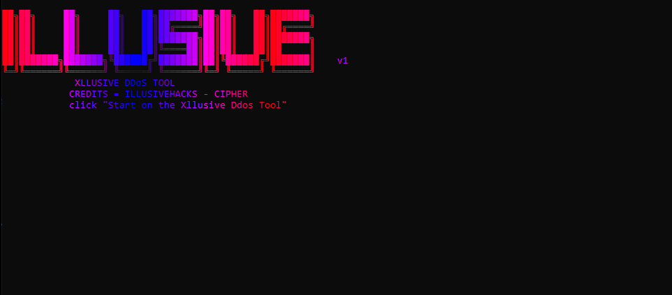
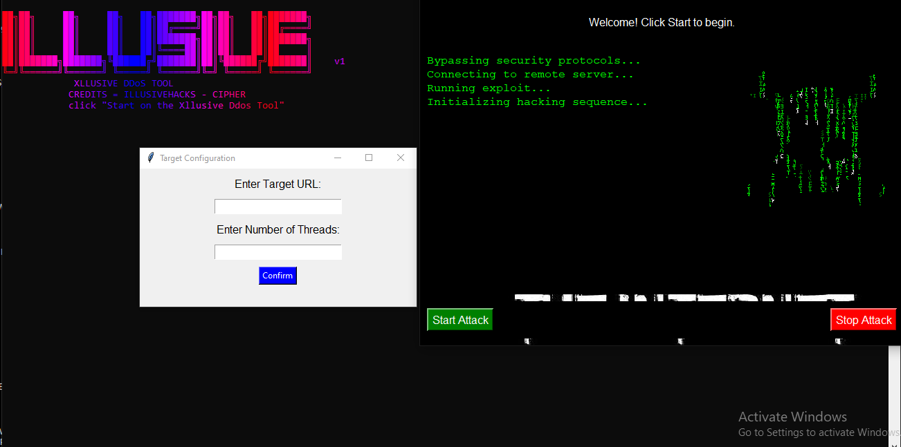

# Xllusive DDoS Tool



## Overview

**Xllusive DDoS Tool** is a powerful educational tool designed to simulate a stress test (DDoS simulation) on a target URL. With a simple graphical user interface (GUI), the tool provides a highly interactive and immersive experience, complete with simulated "hacking" sequences and background animations. This tool is designed for ethical use only—always get proper authorization before conducting any stress tests.

**Important Note:**  
**Unauthorized use of this tool is illegal.** Only perform DDoS simulations on systems that you own or have explicit permission to test.

---

## Features

- **🖥️ Graphical User Interface (GUI)**  
  The tool features an intuitive GUI built using **Tkinter** for easy operation.

- **🎮 Real-Time Hacking Simulation**  
  Enjoy an immersive experience with a scrolling "hacking" code and animated background GIF to simulate a cyber attack.

- **🔐 User Authentication**  
  A password prompt ensures that only authorized users can start the stress test.

- **⚡ Stress Test Configuration**  
  You can specify the target URL and the number of threads to control the intensity of the attack.

- **🛑 Stop Test Option**  
  A button to stop the test anytime.

---

## Screenshots



---

## Requirements

Before running the tool, make sure you have the following:

- **Python 3.8+**  
  Download Python from [python.org](https://www.python.org/downloads/).

- **Required Python Libraries**  
  Install the following libraries using **pip**:

  ```bash
  pip install requests threading colorama pygame Pillow pystyle playsound aiohttp multiprocess


Necessary Files
The following files must be present in the directory:
71316.png (Background Image)
hack-hacker.gif (GIF Animation)
recording.wav (Sound Effect)
images/banner.png (Project Banner Image)
images/screenshot1.png (GUI Screenshot)
Instructions
Clone or Download
Clone or download this repository to your local machine.

bash
Copy code
git clone https://github.com/username/Xllusive-DDoS-Tool.git


Setup
Ensure all necessary files (listed above) are in the same directory as the script.

Run the Tool
Launch the Xllusive DDoS Tool by running the following command:

bash
Copy code
python main.py
Input Target Information

When prompted, enter the Target URL.
Specify the Number of Threads to control the intensity of the stress test.
Authenticate User
A password prompt will appear. Enter the following password to authenticate:

Copy code
illusivehacks1
Start the Stress Test

Once authenticated, click the Start Attack button to begin the stress test.
During the attack, you will see a scrolling code simulation, and the sound will play in the background.
Stop the Stress Test

To stop the test, click the Stop Attack button.
Usage Example
Start the Program
The GUI window will open with the following layout:

Start Attack button to initiate the stress test.
Stop Attack button to stop the test once started.
Text area that shows the status and attack simulation.
Interactive Screen
Upon starting the attack, you’ll see real-time code simulation running on the screen. The background will feature a hacker GIF, and you will hear the hacking sound through your speakers.

Caution
⚠️ Legal Warning:
Only use this tool in a controlled environment or on systems you have explicit permission to stress test. Performing unauthorized DDoS attacks is illegal and unethical.

⚠️ System Resource Usage:
Be cautious with the number of threads you specify. A large number of threads can cause your system to become unresponsive. Start with a low number of threads and gradually increase as needed.

⚠️ Ethical Considerations:
This tool is intended to be used for educational purposes, penetration testing with consent, or within controlled environments for learning.

License
This project is open-source and free to use, but it is strictly for educational purposes. The use of this tool in unauthorized systems or without permission is strictly prohibited.

Acknowledgments
Developed by: IllusiveHacks & Cipher
Special Thanks: To all open-source contributors for the libraries and tools that made this project possible.
Enjoy responsibly!

Contact
For inquiries or feedback, feel free to reach out to the developer at:

GitHub: Illusivehacks GitHub


*License*
This project is licensed under the MIT License - see the LICENSE file for details.

```yaml
Copy code

---

### Image File Placement
Ensure that the following images are placed in the appropriate folder, as mentioned in the markdown:

1. **`images/banner.png`** - Banner image for the top of the README.
2. **`images/screenshot1.png`** - Screenshot of the GUI interface.
3. **`71316.png`** - Background image for the GUI.
4. **`hack-hacker.gif`** - GIF animation for the "hacking" effect.
5. **`recording.wav`** - Sound effect that plays during the attack simulation.

---

### Notes on Customizing
- You can further enhance the aesthetic by customizing colors, fonts, and adding more images to match your project's branding.
- You can also add additional documentation or change the content to reflect new features or modifications.


